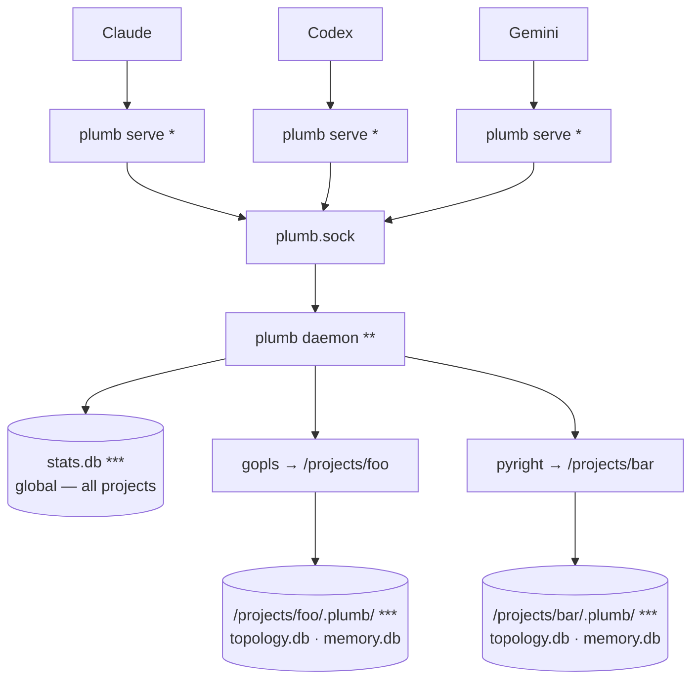

[](https://github.com/plumbkit/plumb/actions/workflows/ci.yml)
[](https://pkg.go.dev/github.com/plumbkit/plumb)
[](https://goreportcard.com/report/github.com/plumbkit/plumb)
[](https://opensource.org/licenses/MIT)

<picture>
  <source media="(prefers-color-scheme: dark)" srcset="site/logo-dark.svg">
  
</picture>

<br>

**IDE intelligence for agents — with guardrails for unattended work.**

Plumb is an [MCP](https://modelcontextprotocol.io) server that gives a coding agent the intelligence layer of an IDE — [LSP](https://microsoft.github.io/language-server-protocol/)-backed semantics, a [tree-sitter](https://tree-sitter.github.io/tree-sitter/) code index, and project memory — inside guardrails: atomic, lock-serialised writes with transactional rollback, scoped filesystem and git access, and a daemon that survives its own crashes. A single binary; nothing else to install.

---

## Why Plumb

LLM agents usually work by reading whole files into the context window — token-heavy, lossy at scale, blind to symbol semantics, and unsafe to let loose on a real repo. Plumb is built on three pillars, in priority order.

### 1. Reliability & write-safety
Leaving an agent to edit a codebase for an hour is only viable if writes can't corrupt files and a crash can't wedge your session.

- **Atomic I/O** — every write is staged in a temp file and renamed into place. No partial writes, ever. Symlink-aware, CRLF-tolerant.
- **Per-path locking** — the daemon serialises concurrent writes to the same file across every session and chat window. No races.
- **Multi-file transactions** — apply edits across dozens of files with guaranteed atomic rollback if any step fails.
- **Crash-resilient daemon** — `plumb serve` is a reconnecting proxy. If the daemon crashes or hangs, it respawns one and replays the handshake; the agent never notices. In-flight writes are never silently re-run.
- **Optimistic concurrency** — mtime/sha guards catch stale edits before they clobber newer changes.

See it run: [`docs/demos/`](docs/demos/) — `two-agents-one-file.sh` (a stale write is refused, nothing is lost) and `daemon-respawn.sh` (below — the daemon is killed mid-session; the agent's next edit still succeeds):


### 2. Semantic intelligence
The same primitives your editor has, exposed as structured tools:

- **LSP-backed refactors** — `rename_symbol`, `replace_symbol_body`, `safe_delete_symbol` understand scope, types, and references.
- **Real diagnostics inline** — actual `gopls`/`pyright` output is appended to every write, so the agent learns it broke the build immediately.
- **Symbol search** — scoped to your code, no stdlib or dependency noise.

### 3. Context efficiency & safety controls
- **Read only what you need** — symbols or line ranges, not 2,000-line files.
- **Scoped access you control** — a per-connection path allowlist (read-only vs read-write roots) plus tiered git gating (destructive and network operations are off by default and need explicit confirmation). See [SECURITY.md](SECURITY.md).
- **One-round-trip bootstrap** — `session_start` returns workspace, branch, recent commits, diagnostics, and project memory.

See the measured, reproducible numbers behind this: [**docs/use-cases.md**](docs/use-cases.md) — reading one function is ~8× less context than the whole file, and `find_references` returns the real call sites where a text search is ~44% noise.

---

## Get started

Plumb is a single binary — from zero to your first answer:

**1. Install**

```sh
# Homebrew (macOS + Linux) — recommended
brew install plumbkit/plumb/plumb

# or with Go
go install github.com/plumbkit/plumb/cmd/plumb@latest

# or grab a prebuilt binary: https://github.com/plumbkit/plumb/releases
```

> **macOS note:** prebuilt binaries are not yet notarised — on first run you may
> need `xattr -d com.apple.quarantine ./plumb`, or right-click → Open. Homebrew
> installs avoid this.

**2. Connect your agent**

```sh
plumb setup claude-code      # also: claude-desktop, codex, gemini, cursor, …
```

`plumb setup` writes the MCP config for you — no hand-editing JSON.

**3. Open your project and try it**

Make sure the language server you need is on your `$PATH` (`gopls` for Go,
`pyright` for Python, …), then point your agent at a real question. In Claude
Code:

```sh
cd your/project
claude "Use plumb to orient in this repo (session_start), then show me
everywhere <Handler> is called and what would break if I changed its signature."
```

Plumb resolves the workspace and runs `session_start` for orientation, then
answers with real LSP and topology data — actual call sites and blast radius —
instead of guessing from file dumps. It's read-only; nothing is modified. (Any
connected agent works — just paste the prompt.)

> No `go.mod`/`pyproject.toml` and not a git repo? Run `plumb init` once to pin
> the workspace root (it also seeds `.plumb/context.md` and project config).

Full walkthrough → [**docs/getting-started.md**](docs/getting-started.md).

---

## Language support (honest version)

Plumb negotiates LSP capabilities per language and also ships a built-in tree-sitter index for search and navigation with no language server. Support comes in tiers — we'd rather be precise than claim a big number.

| Tier | Languages | What you get |
|---|---|---|
| **First-class** (CI-tested, real-binary integration) | **Go** (gopls), **Python** (pyright) | Full LSP: definitions, references, rename, diagnostics, hierarchies + all write tools |
| **Validated** | **Java** (jdtls), **Rust** (rust-analyzer), **Swift** (sourcekit-lsp), **TypeScript/JS** (typescript-language-server), **Zig** (zls) | Full LSP; just put the server on `$PATH` and it activates automatically |
| **Experimental** | **Kotlin**, **HTML** | Navigation works against the real servers; diagnostics validation is still in progress. Put the server on `$PATH` to activate (exclude any language with `[lsp.<lang>] enabled = false`) |
| **Search & navigation** (tree-sitter, no LSP needed) | 15+ incl. JS/TS/TSX, Bash, SQL, HCL, Dockerfile, TOML, YAML, Markdown | Ranked symbol search, outlines, graph exploration via the Topology index |

Real-binary validation has been exercised on **macOS**; Linux integration runs in CI and is being hardened pre-v1. Windows is [tracked but not yet supported](https://github.com/plumbkit/plumb/issues) — the daemon's Unix-socket architecture needs a port.

---

## How it works

`plumb serve` is a thin, reconnecting stdio proxy. The real work happens in one shared background daemon, so language servers stay warm across chats.



`*` `plumb serve` is a reconnecting proxy — if the daemon crashes or hangs it respawns one and replays the handshake, so your session survives without the agent noticing.

`**` one shared process, reused across every conversation.

`***` SQLite. One **global** `stats.db` (tool stats + episodic summaries); two **per-project** indexes under each workspace's `.plumb/` — `topology.db` (the code graph) and `memory.db` (memory search). Schema details → [**docs/architecture.md**](docs/architecture.md#databases-at-a-glance).

Servers stay warm across chats, per-path locks are shared across every connection, and symbol indexes update live after each write. Full architecture → [**docs/architecture.md**](docs/architecture.md).

---

## Monitoring (TUI)

Run `plumb` with no arguments for a live dashboard — see what your agent is doing in real time: every tool call as it happens, daemon health, per-tool stats, and streaming logs you can follow and filter. The fastest way to catch a runaway loop or confirm an edit landed.

---

## Core capabilities

Plumb exposes **61 tools**. The ones you'll use constantly:

`session_start` · `find_symbol` · `get_definition` · `find_references` · `rename_symbol` · `edit_file` · `transaction_apply` · `diagnostics`

The rest cover filesystem reads/writes, LSP hierarchies, tiered git, an optional local **Topology** index (ranked search + blast-radius/route analysis, no language server needed), and durable per-project memory. Full API reference: [**docs/tools.md**](docs/tools.md).

---

## Configuration

Global or per-project `config.toml`, or environment variables. Run `plumb config show` to see the resolved config with provenance.

```toml
[edits]
strict = true                  # require read_file before edit_file
rate_limit_per_minute = 30     # bound runaway agent loops

[git]
allow_destructive = false      # reset/checkout/rebase off by default
allow_push = false             # push/fetch/pull off by default
```

Full settings reference: [**docs/configuration.md**](docs/configuration.md).

---

## The hard part

Agents can already *read* code well enough; writing it unsupervised — concurrently, transactionally, recoverably — is what's still unsolved. Plumb is the bet that this is the half worth getting right first. It's early, and the language coverage says so: a small validated core, the rest clearly marked experimental.

---

## Roadmap

Plumb is pre-1.0. The core — write-safety, the resilient daemon, the topology index, and project memory — is in daily use. The road to 1.0 is mostly about *proving* it beyond the validated core and smoothing distribution. Issues and ideas welcome.

**Shipped**

- [x] Concurrency-safe, atomic, transactional writes with rollback
- [x] Crash-resilient reconnecting daemon
- [x] Tree-sitter topology index + per-project memory
- [x] Go and Python LSP adapters validated (real-binary)

**Getting to 1.0.** Rather than jump from 0.9 straight to 1.0, Plumb ships a series of focused minor releases — **0.10 through 0.19** — each with one coherent theme. **0.19.x is the last 0.x release;** 1.0 follows it as a deliberate stability commitment. Native Windows support is intentionally a post-1.0 (1.1) item, not a 1.0 gate. The themed plan:

- **0.10** — distribution + honest claims (Homebrew, semantic re-rank → GA)
- **0.11** — validate the experimental LSP adapters on real binaries (zls ✓ validated; Kotlin needs a real Gradle/Maven project)
- **0.12** — Swift on Xcode via Build Server Protocol guidance
- **0.13** — daemon robustness (git-write crash safety, liveness probe)
- **0.14** — agent ergonomics + tool surface
- **0.15** — honesty + full config surface
- **0.16** — stabilisation + cross-platform proving
- **0.17** — distribution + discoverability (registries)
- **0.18** — proof + docs
- **0.19** — soak + feedback, the last 0.x (rolling patches, not a formal RC)
- **1.0** — general availability: the stability + validated-core promise

Full detail, rationale, and the post-1.0 items (Windows, tree-sitter cleanup) are in [docs/roadmap.md](docs/roadmap.md).

## Contributing

See [CONTRIBUTING.md](CONTRIBUTING.md) and [AGENTS.md](AGENTS.md) for architecture and code style. We follow Australian English in all prose. By contributing you agree to the [Code of Conduct](CODE_OF_CONDUCT.md).

## License

MIT — see [LICENSE](LICENSE).
