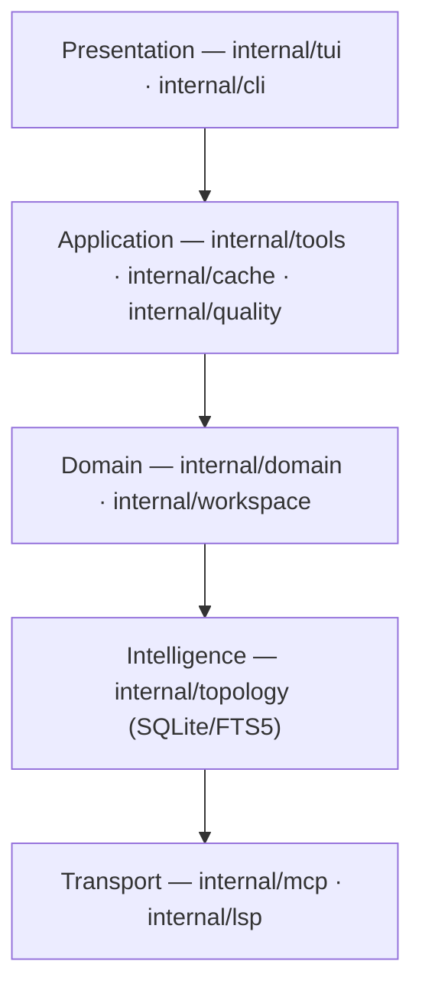
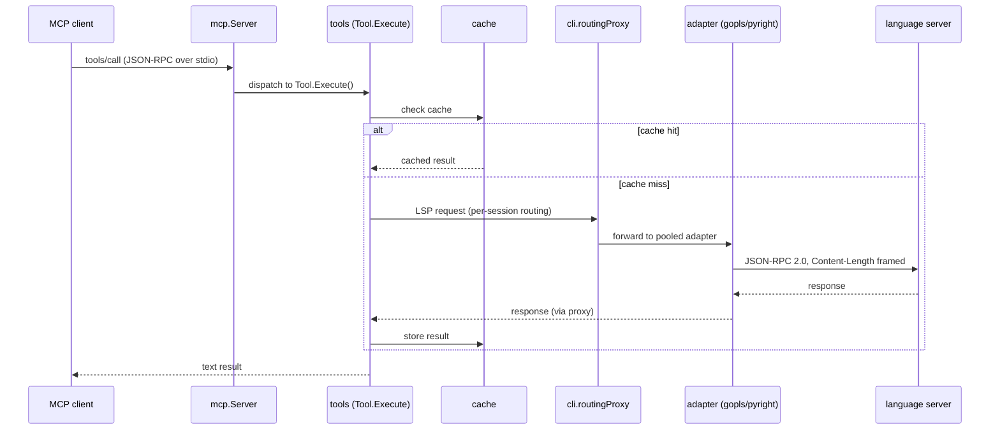
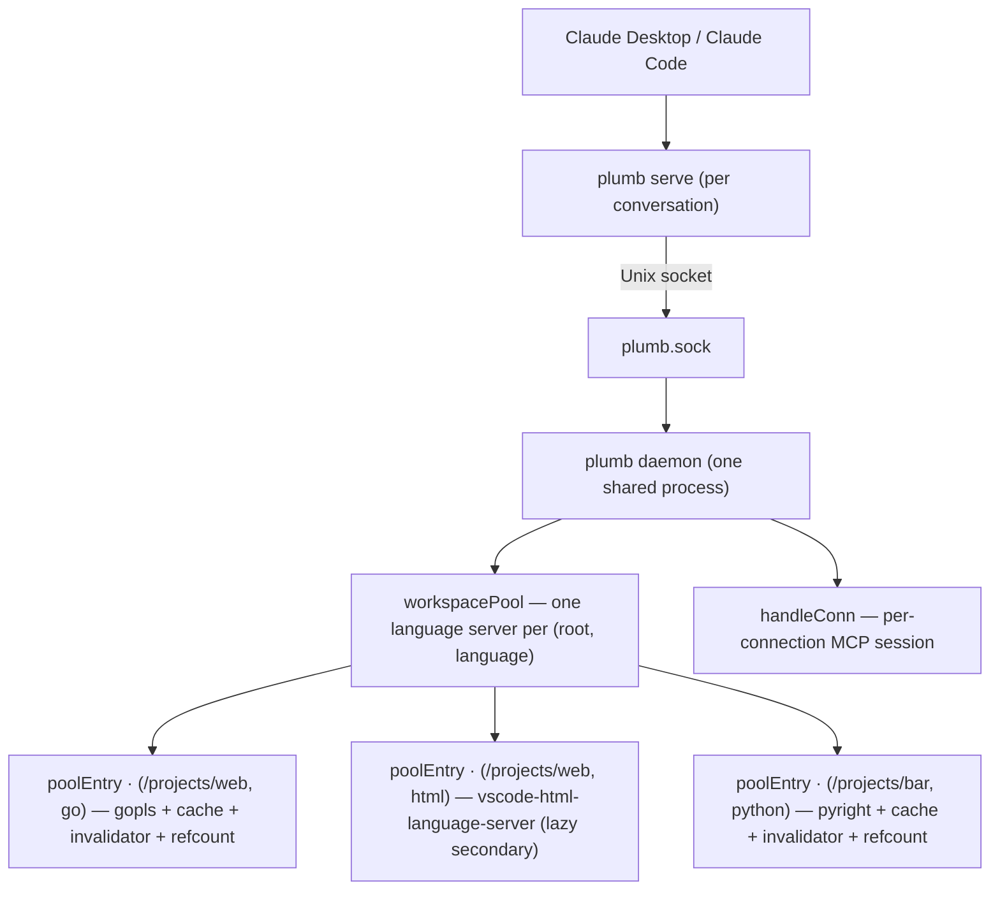
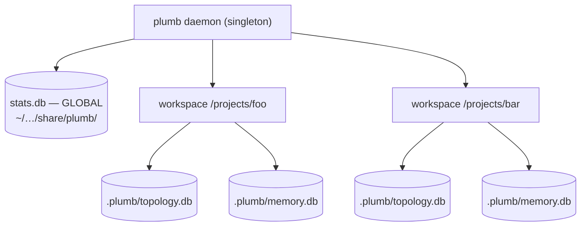
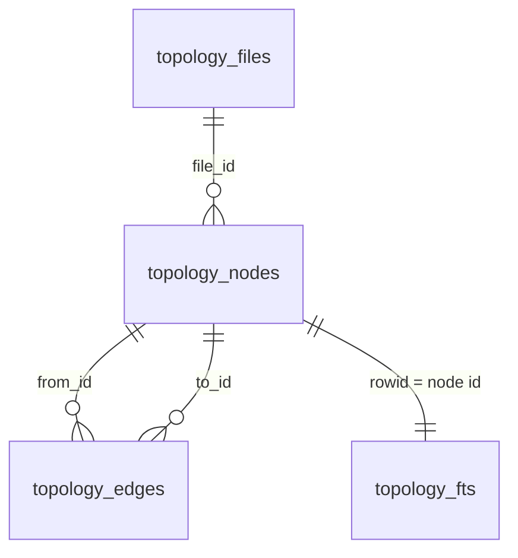
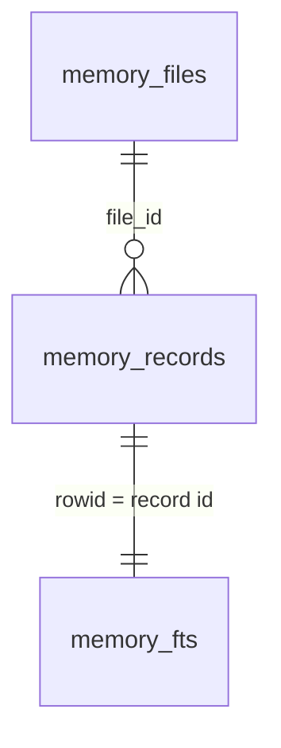
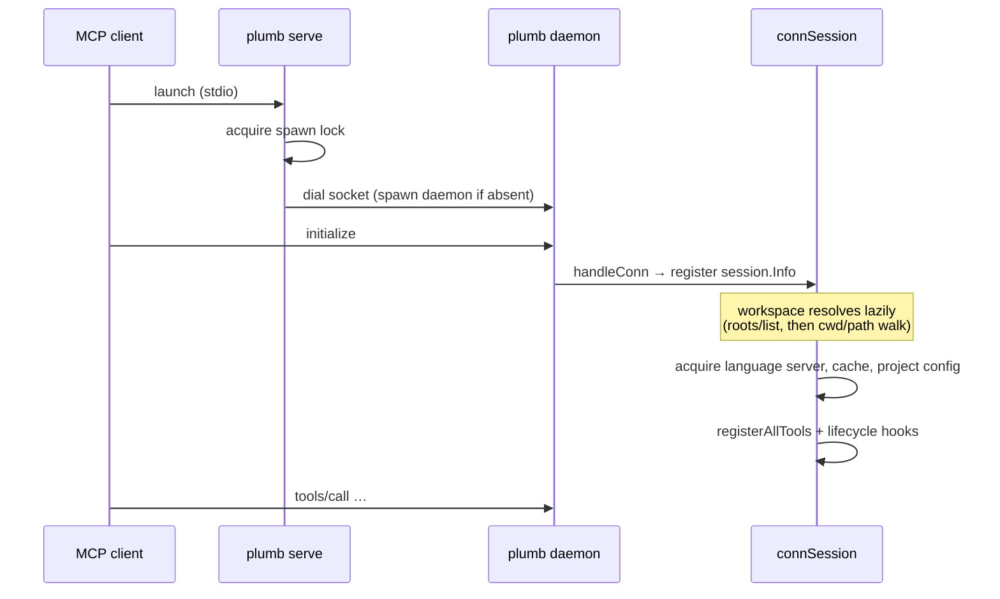

# Architecture

Plumb is an MCP (Model Context Protocol) server that exposes LSP (Language
Server Protocol) capabilities to LLMs.  Instead of dumping raw source files
into an LLM's context, clients call structured tools (`find_symbol`,
`get_definition`, `explain_symbol`) and receive focused, language-aware
answers from a real language server running under the hood.

## Layers



**Rule: lower layers must never import higher layers.**  The transport layer
knows nothing about tools or the CLI; tools know nothing about the TUI.

### Package map

| Package | Role |
|---|---|
| `cmd/plumb` | Entry point — calls `cli.Execute()` |
| `internal/cli` | Cobra subcommands: `serve`, `daemon`, `stop`, `init`, `setup`, `version`, `config`, `sessions`, `stats` (alias `status`), `diagnostics`, `doctor`, `log-level`; per-connection session wiring; workspace + topology pools |
| `internal/tui` | Bubble Tea v2 TUI: dashboard widgets, sessions, memory, logs, settings, stats, and recent calls |
| `internal/tools` | MCP tool implementations (61 tools — see `docs/tools.md`); `WriteDeps` bundles write-tool dependencies; the `txlog` subpackage is the transaction rollback WAL |
| `internal/quality` | Offline post-write code analysers (golangci-lint, ruff, …) against changed files; findings appended to write responses; `golangcilint` subpackage |
| `internal/cache` | Sharded TTL cache + LSP invalidator |
| `internal/session` | Per-connection session registry with client identity tracking |
| `internal/stats` | Global SQLite tool-call statistics, row-scoped by workspace and session (WAL, per-tool summary, P95, client-aware, `user_version` 13); also holds the `episodic_memories` table for idle-session summaries |
| `internal/memory` | Per-workspace markdown memory store (`<workspace>/.plumb/memories/`) |
| `internal/topology` | SQLite/FTS5 semantic graph; background indexer; Go AST + pure-Go tree-sitter (gotreesitter, many languages) + canonical-grammar WASM via wazero for TypeScript/TSX/JSX + Swift (`extractors/{golang,treesitter,wasmts}`); search + BFS explore/impact/affected/routes |
| `internal/render` | Shared, pure CLI/TUI presentation helpers (leaf-level: stdlib + rendering libs only) |
| `internal/fsguard` | Guards filesystem walks against macOS TCC false-positive prompts on protected dirs ($HOME, Desktop, Documents, …) |
| `internal/monitor` | Process resource-usage snapshots (CPU %, memory) plus the daemon start time, with per-OS implementations; feeds the TUI daemon metrics and its uptime baseline |
| `internal/mcp` | MCP server, `Tool` interface, stdio transport, hook callbacks |
| `internal/lsp` | `LSPClient` interface, process supervisor |
| `internal/lsp/jsonrpc` | JSON-RPC 2.0 over LSP content-framed stdio (server-request support); mock for testing |
| `internal/lsp/protocol` | LSP types and method-name constants |
| `internal/lsp/adapters/gopls` | Validated Go adapter (unit- + integration-tested) |
| `internal/lsp/adapters/pyright` | Validated Python adapter (unit- + integration-tested) |
| `internal/lsp/adapters/jdtls` | Java adapter (validated, experimental tier); activates automatically when `jdtls` (+ a Java 21+ runtime) is on PATH; set `[lsp.java] enabled = false` to exclude |
| `internal/config` | TOML config, XDG path resolution, project-config merging; `config.Store` holds the live global base (atomic pointer + generation + observers) for hot-reload |
| `internal/domain` | Reserved for future shared domain types (currently empty) |
| `internal/workspace` | Reserved for future routing logic (currently empty) |

### Charm dependency rule

Plumb's UI stack is Bubble Tea v2 only. Use `charm.land/bubbletea/v2`,
`charm.land/lipgloss/v2`, and `charm.land/bubbles/v2` for all TUI and CLI
presentation work. Do not add or import the v1 module paths (`charm.land/bubbletea`,
`charm.land/lipgloss`, or `charm.land/bubbles`); mixing v1 and v2 Charm modules
causes incompatible model, command, and style types.

## Plumb Topology vs. LSP (The Dual-Engine Architecture)

Plumb pairs two complementary technologies to solve the context efficiency problem for AI agents: **Topology** and **LSP**. They do not compete; they handle different phases of the agent's workflow.


### 1. Plumb Topology (The Map)
Topology uses **Go AST plus pure-Go tree-sitter (gotreesitter) and canonical-grammar WASM (wazero) extractors** spanning many languages, and a local **SQLite/FTS5** database to maintain a persistent semantic graph of the codebase (symbols, calls, imports). **On by default** (opt out with `[topology] enabled = false`). It is exposed through the `topology_*` tools (`topology_status`, `topology_search`, `topology_explore`, `topology_impact`, `topology_affected`, `topology_routes`) plus `structural_query`. See the dedicated [Topology guide](topology.md) for an accessible overview of what it is, why it exists, and how it works.
*   **Strengths:** Instant availability (no LSP boot time), minimal memory footprint, handles broken code gracefully, FTS5 ranked search, BFS neighbourhood exploration.
*   **Role in Plumb:** Discovery engine. When an agent asks "Where is the routing logic?" or needs to see a symbol's neighbourhood, Topology handles it without waiting for the language server to index.
*   **Trade-offs:** Syntactic extraction only — no type resolution. "Broad" recall, not compiler-level precision.

### 2. Language Server Protocol (The GPS)
LSP uses heavy, compiler-backed servers (like `gopls` or `pyright`) to provide 100% accurate semantic truth.
*   **Strengths:** Perfect type awareness, safe cross-file refactoring, real-time diagnostics, and compiler-level guarantees.
*   **Role in Plumb:** Precision engine. Once Topology has helped the agent find *where* to work, LSP tools (`rename_symbol`, `diagnostics`) safely manipulate the code and verify the change.
*   **Trade-offs:** Heavy resource usage, slow indexing times on large codebases ("startup gap"), and strictly limited to languages where the user has a validated LSP installed.

By combining the **Speed and Breadth of Topology** with the **Precision and Safety of LSP**, Plumb provides agents with the optimal balance of token efficiency and operational reliability.

## Tooling Ecosystem Integration

While Plumb focuses on providing the **Map** (Topology) and the **GPS** (LSP), it is designed to work within a broader ecosystem of language-specific tooling. This ecosystem ensures code quality, consistency, and correctness through several key categories:

1. **Formatters (fmt)**: These tools (e.g., `gofumpt`, `ruff format`, `prettier`) automatically adjust code layout. Plumb integrates with formatters via the `format_after: true` flag in tools like `find_replace`, ensuring that any text-based changes adhere to the project's style guide.
2. **Linters (lint)**: Linters (e.g., `golangci-lint`, `ruff check`, `eslint`) analyze code for bugs and convention violations. While LSP provides real-time feedback, linters often perform deeper or more opinionated checks that complement the LSP's diagnostics.
3. **Type Checkers**: For dynamic languages, type checkers (e.g., `mypy`, `pyright`, `tsc`) provide static guarantees. Plumb surfaces these guarantees by proxying the diagnostics emitted by the underlying language server.
4. **Test Runners**: Automated tests (e.g., `go test`, `pytest`, `jest`) validate the semantic correctness of changes. Plumb currently delegates test execution to the user or the MCP client, but the changes it makes are intended to be verified by these runners.
5. **Build Tools**: Orchestrators (e.g., `go build`, `maven`, `npm`) manage dependencies and compilation. The LSP relies on these tools to maintain an accurate internal project model, and Plumb ensures that filesystem writes are atomic and visible to the build system.

## Data flow: MCP tool call



Cache invalidation runs in the opposite direction: when gopls sends a
`textDocument/publishDiagnostics` notification, `cache.Invalidator.Handle`
is invoked (via `adapter.Subscribe`) and evicts all cache entries whose key
contains the changed file's URI.

## Daemon architecture

`plumb serve` is a thin stdio proxy. The real server is `plumb daemon`, a
long-lived background process that owns the gopls subprocesses:



Key design properties:

- **Single source of truth for runtime files** — socket and PID file live under
  `os.UserCacheDir()/plumb/` so paths stay stable across GUI-app and terminal
  launches (macOS `$TMPDIR` is unreliable across these). The daemon log is the
  one exception: it lives in the OS log dir (`~/Library/Logs/plumb/` on macOS),
  not the cache dir.
- **Singleton enforced by `flock(2)`** — two advisory locks (`plumb.spawn.lock`
  held briefly by `plumb serve` around its dial-or-spawn block, and
  `plumb.daemon.lock` held by `plumb daemon` for its lifetime) guarantee at
  most one daemon process ever binds the socket. Without them, two `plumb
  serve` processes racing from a cold start could each spawn a daemon and the
  second would `os.Remove(socketPath); net.Listen(...)`, quietly stealing the
  path from the first. Lock release is automatic via fd close on process
  exit (clean or crash) — see `internal/cli/lock.go`.
- **One language server per (root, language)** — multiple MCP connections to
  the same project share each server, its cache, and its diagnostic stream. A
  root may bind several servers at once (e.g. Go + HTML for a web app): each
  file is routed to the server that owns its extension. The **primary** language
  (resolved from root markers — `go.mod` beats `index.html` when both are
  present) is pinned, and each connection that attaches a workspace as its
  primary holds a reference; when the last session on a root detaches, the
  primary is torn down after a 90 s idle grace so it stays warm across a quick
  disconnect-reconnect but is eventually reclaimed when the workspace is idle.
  **Secondary** servers start lazily on the first file of their language and
  live to daemon shutdown. A secondary activates automatically when its server
  binary is on PATH (`[lsp.<lang>] enabled = false` excludes it).
- **Per-connection sessions** — `handleConn` registers a `session.Info`
  immediately on connection (with `Folder=""` until workspace resolves). The
  session is then patched as workspace and client identity become known.
  This means `plumb sessions` and the TUI show new conversations *instantly*,
  not after the first LSP tool call.
- **Stop strategy** — `plumb stop` searches for the daemon in three stages:
  PID file → `lsof` on the socket → `pgrep -f "plumb daemon"`. The pgrep
  fallback covers binary upgrades that change the socket/PID path.

## Persistence layout

| Path | Owner | Purpose |
|---|---|---|
| `~/.config/plumb/config.toml` | user | LSP commands, cache TTL, log level |
| `~/.local/share/plumb/sessions/<id>.json` | daemon | Active session metadata (one file per MCP connection) |
| `~/.local/share/plumb/stats.db` | daemon (writer) / TUI + `plumb stats` (readers) | Global tool call statistics, SQLite WAL, row-scoped by workspace and session |
| `~/Library/Caches/plumb/plumb.sock` | daemon | Unix socket for MCP proxy connections |
| `~/Library/Caches/plumb/plumb.pid` | daemon | PID for `plumb stop` lookup |
| `~/Library/Caches/plumb/plumb.spawn.lock` | serve | Advisory `flock` serialising daemon spawn decisions across racing `plumb serve` processes |
| `~/Library/Caches/plumb/plumb.daemon.lock` | daemon | Advisory `flock` held for the daemon's lifetime; rejects duplicate daemons |
| `~/.local/state/plumb/daemon.log` | daemon | slog text output (OS log dir; `~/Library/Logs/plumb/` on macOS) |
| `<workspace>/.plumb/context.md` | user | Project-wide context loaded at session start |
| `<workspace>/.plumb/memories/<name>.md` | LLM via memory tools | Per-workspace persistent notes |
| `<workspace>/.plumb/topology.db` | daemon (when `[topology] enabled`) | Per-workspace SQLite/FTS5 semantic code index (rebuildable) |
| `<workspace>/.plumb/memory.db` | daemon (when `[memory] enabled`) | Per-workspace SQLite/FTS5 index over `.plumb/memories/*.md` (rebuildable) |

XDG: `XDG_DATA_HOME` (sessions and stats) and `XDG_CONFIG_HOME` (config) are
respected when set. Cache paths use `os.UserCacheDir()` directly because they
are runtime, not data — see Daemon architecture above for why.

plumb resolves these locations through `internal/paths`, which delegates to
`github.com/adrg/xdg` for config/data/state/cache. The daemon log is the sole
hand-rolled per-OS path: macOS keeps user logs in `~/Library/Logs/` (which no
XDG base maps to), so `paths.LogDir` special-cases it. The table above shows the
Linux layout. On macOS config and data (sessions, `stats.db`) live under
`~/Library/Application Support/plumb/`, the daemon log under `~/Library/Logs/plumb/`,
and cache files (socket, pid, locks) under `~/Library/Caches/plumb/`. A pre-0.9.8 config at
`~/.config/plumb/config.toml` is still read as a fallback.

### Databases at a glance

plumb persists to **three** SQLite databases — one **global**, two **per
project** — alongside plain files (config, sessions, markdown memories). The
split follows ownership: the daemon is a singleton shared across every
conversation, so global state lives in one file keyed by `workspace` and
`session_id`, while each project's semantic indexes live inside that project's
`.plumb/` directory.

| Database | Scope | Location (Linux / macOS) | Tables | Lifecycle |
|---|---|---|---|---|
| `stats.db` | **Global** — every project, one per daemon | `~/.local/share/plumb/` · `~/Library/Application Support/plumb/` | `tool_calls`, `episodic_memories` | Durable primary data; forward-migrated (`PRAGMA user_version`, currently 13) |
| `topology.db` | **Per project** | `<workspace>/.plumb/` | `topology_files`, `topology_nodes`, `topology_edges`, `topology_fts`, `topology_embeddings` | Rebuildable index; dropped & recreated on a version bump |
| `memory.db` | **Per project** | `<workspace>/.plumb/` | `memory_files`, `memory_records`, `memory_fts` | Rebuildable index over the markdown memories |

Only `stats.db` holds primary data, so it is the only one with data-preserving
migrations. The two per-project databases are *rebuildable* indexes — their
source of truth lives elsewhere (the working tree for `topology.db`, the
markdown files under `.plumb/memories/` for `memory.db`) — so `.plumb/.gitignore`
excludes them and a schema bump simply drops and rebuilds rather than migrating.
All three open in WAL mode.



The per-database schemas, indexes, and relationships follow.

### Statistics database (`stats.db`)

Single global SQLite file with two tables. The primary `tool_calls` table
records every MCP tool invocation:

```sql
CREATE TABLE tool_calls (
    id           INTEGER PRIMARY KEY AUTOINCREMENT,
    session_id   TEXT    NOT NULL DEFAULT '',  -- session.Info.ID
    session_name TEXT    NOT NULL DEFAULT '',  -- session.Info.Name
    workspace    TEXT    NOT NULL DEFAULT '',  -- absolute project root
    tool         TEXT    NOT NULL,              -- e.g. "find_symbol"
    called_at    INTEGER NOT NULL,              -- Unix milliseconds
    duration_ms  INTEGER NOT NULL DEFAULT 0,    -- wall-clock execution time
    input_bytes  INTEGER NOT NULL DEFAULT 0,    -- raw JSON arg length
    output_bytes INTEGER NOT NULL DEFAULT 0,    -- text response length
    success      INTEGER NOT NULL DEFAULT 1,    -- 1 = ok, 0 = error
    error_msg    TEXT    NOT NULL DEFAULT '',
    input_json   TEXT    NOT NULL DEFAULT '',   -- raw tool args, capped
    output_text    TEXT  NOT NULL DEFAULT '',   -- tool output, capped
    client_name    TEXT  NOT NULL DEFAULT '',   -- MCP clientInfo.name
    client_version TEXT  NOT NULL DEFAULT '',   -- MCP clientInfo.version
    tokens_saved          INTEGER NOT NULL DEFAULT 0,  -- counterfactual savings total
    savings_model_version INTEGER NOT NULL DEFAULT 0,  -- scoring-model version (0 = pre-redesign, excluded)
    capability_tokens     INTEGER NOT NULL DEFAULT 0,  -- work a thin client couldn't do natively
    efficiency_tokens     INTEGER NOT NULL DEFAULT 0,  -- fewer tokens for the same result
    purpose               TEXT    NOT NULL DEFAULT ''  -- optional session purpose tag (session.Info.Purpose)
);
CREATE INDEX idx_tc_tool      ON tool_calls(tool);
CREATE INDEX idx_tc_called_at ON tool_calls(called_at);
CREATE INDEX idx_tc_session   ON tool_calls(session_id);
CREATE INDEX idx_tc_workspace ON tool_calls(workspace);
CREATE INDEX idx_tc_ws_session ON tool_calls(workspace, session_id);
CREATE INDEX idx_tc_tool_dur  ON tool_calls(tool, duration_ms);
```

The second table, `episodic_memories` (added in schema v8), stores the
rule-based summaries written when a session goes idle — the "last session"
recap surfaced at `session_start`:

```sql
CREATE TABLE episodic_memories (
    id            INTEGER PRIMARY KEY AUTOINCREMENT,
    workspace     TEXT    NOT NULL DEFAULT '',
    session_id    TEXT    NOT NULL DEFAULT '',
    session_name  TEXT    NOT NULL DEFAULT '',
    generated_at  INTEGER NOT NULL,              -- Unix milliseconds
    summary       TEXT    NOT NULL DEFAULT '',
    touched_files TEXT    NOT NULL DEFAULT '',
    read_count    INTEGER NOT NULL DEFAULT 0,
    write_count   INTEGER NOT NULL DEFAULT 0
);
CREATE INDEX idx_em_ws ON episodic_memories(workspace, generated_at);
```

Neither table is FK-linked: both carry `workspace` + `session_id` as plain
columns so the single global store can be filtered down to one project or one
session at query time.

Concurrency model:

- **WAL journal mode** (`?_journal_mode=WAL`) is enabled at open time. This
  is essential because the daemon (writer) and the TUI / `plumb stats`
  (readers) run in separate OS processes — WAL allows concurrent readers
  while a single writer proceeds, without blocking either side.
- **Single writer** — the daemon process holds one connection
  (`SetMaxOpenConns(1)`) protected by an internal `sync.Mutex` around the
  insert path. There is no UPDATE or DELETE traffic.
- **Read-only readers** — the TUI opens the same file with `?mode=ro`. If
  the file does not yet exist (no calls recorded), the read open returns
  `(nil, nil)` and the caller renders "No statistics yet."
- **Best-effort writes** — `Record` returns insert errors so the daemon can log
  storage failures, but stats must never break a tool call.

Every successful or failed `tools/call` triggers `srv.OnAfterTool`, which the
daemon connects to `statsDB.Record(stats.Call{...})` capturing tool name,
workspace, session, timing, and I/O sizes. The workspace and session fields are
required row attributes because the single stats database contains all projects
served by the single daemon.

Schema versioning is driven by `PRAGMA user_version` (currently 13). `stats.Open()`
(the daemon — the single writer) applies forward migrations (`ALTER TABLE ADD
COLUMN`) when the on-disk version is older, then stamps the current version, so
existing history is preserved across upgrades. `OpenReadOnly()` (TUI, `plumb
stats`) does not migrate; it reports a schema-upgrade-required notice until the
daemon migrates the file.

### Topology database (`topology.db`)

Per-workspace semantic index of the code graph — **nodes** (symbols) and
**edges** (relationships between them) — plus an FTS5 search index and an
optional embedding cache. Built and kept live by the background indexer; it
backs the six `topology_*` tools and the LSP→topology fallback. Lives at
`<workspace>/.plumb/topology.db` (WAL, `PRAGMA foreign_keys = ON`). Defined in
`internal/topology/db.go`.

```sql
CREATE TABLE topology_meta (            -- key/value: schema version, last sync
    key   TEXT PRIMARY KEY,
    value TEXT NOT NULL DEFAULT ''
);

CREATE TABLE topology_files (           -- one row per indexed file
    id            INTEGER PRIMARY KEY AUTOINCREMENT,
    path          TEXT    NOT NULL UNIQUE,       -- workspace-relative path
    language      TEXT    NOT NULL DEFAULT '',
    mtime_ns      INTEGER NOT NULL DEFAULT 0,    -- freshness anchor
    content_hash  TEXT    NOT NULL DEFAULT '',    -- SHA-256; reindex trigger
    extractor_ver TEXT    NOT NULL DEFAULT '',
    indexed_at    INTEGER NOT NULL DEFAULT 0,
    error_msg     TEXT    NOT NULL DEFAULT ''
);
CREATE INDEX idx_tf_path ON topology_files(path);

CREATE TABLE topology_nodes (           -- one row per symbol
    id         INTEGER PRIMARY KEY AUTOINCREMENT,
    file_id    INTEGER NOT NULL REFERENCES topology_files(id) ON DELETE CASCADE,
    kind       TEXT    NOT NULL,                 -- function, type, method, …
    name       TEXT    NOT NULL DEFAULT '',      -- unqualified name
    qualified  TEXT    NOT NULL DEFAULT '',      -- fully-qualified name
    signature  TEXT    NOT NULL DEFAULT '',
    start_line INTEGER NOT NULL DEFAULT 0,
    end_line   INTEGER NOT NULL DEFAULT 0,
    docstring  TEXT    NOT NULL DEFAULT '',
    language   TEXT    NOT NULL DEFAULT '',
    has_bytes      INTEGER NOT NULL DEFAULT 0,   -- 1 ⇒ byte/col spans valid
    start_byte     INTEGER NOT NULL DEFAULT 0,
    end_byte       INTEGER NOT NULL DEFAULT 0,
    start_col      INTEGER NOT NULL DEFAULT 0,
    end_col        INTEGER NOT NULL DEFAULT 0,
    doc_start_byte INTEGER NOT NULL DEFAULT 0,   -- 0 ⇒ no doc comment
    doc_end_byte   INTEGER NOT NULL DEFAULT 0
);
CREATE INDEX idx_tn_file ON topology_nodes(file_id);
CREATE INDEX idx_tn_name ON topology_nodes(name);
CREATE INDEX idx_tn_kind ON topology_nodes(kind);

CREATE TABLE topology_edges (           -- directed relationship between two nodes
    id         INTEGER PRIMARY KEY AUTOINCREMENT,
    from_id    INTEGER NOT NULL REFERENCES topology_nodes(id) ON DELETE CASCADE,
    to_id      INTEGER NOT NULL REFERENCES topology_nodes(id) ON DELETE CASCADE,
    kind       TEXT    NOT NULL,                 -- call, reference, contains, …
    confidence REAL    NOT NULL DEFAULT 1.0,
    source     TEXT    NOT NULL DEFAULT 'extractor'  -- 'extractor' | 'inferred'
);
CREATE INDEX idx_te_from ON topology_edges(from_id);
CREATE INDEX idx_te_to   ON topology_edges(to_id);

-- FTS5 search index; rowid mirrors topology_nodes.id
CREATE VIRTUAL TABLE topology_fts USING fts5(
    name, name_tokens, qualified, signature, docstring, path, kind,
    tokenize = 'unicode61 remove_diacritics 2'
);

-- opt-in embedding cache for semantic re-rank; keyed by content hash (not node
-- id) so a vector survives a resync and is shared across identical symbol text
CREATE TABLE topology_embeddings (
    model        TEXT    NOT NULL,
    content_hash TEXT    NOT NULL,
    dim          INTEGER NOT NULL,
    vector       BLOB    NOT NULL,               -- little-endian float32
    PRIMARY KEY (model, content_hash)
);
```

Relationships (every FK is `ON DELETE CASCADE`, so deleting a file removes its
nodes, and deleting a node removes its edges):



`topology_fts` is an FTS5 virtual table whose `rowid` equals the indexed
`topology_nodes.id`. `topology_embeddings` is deliberately **not** FK-linked to
a node — keying it on `(model, content_hash)` lets one vector serve every symbol
with identical text and outlive a reindex.

**Lifecycle.** `topology.db` is a *rebuildable* index, versioned by `PRAGMA
user_version` (currently 1). When the on-disk version is older the indexer DROPs
and recreates every table rather than migrating — the working tree is the source
of truth, so the resync that runs at each attach repopulates it. `topology.db`
(and its `-wal`/`-shm` siblings) is auto-added to `<workspace>/.plumb/.gitignore`.

### Memory index database (`memory.db`)

Per-workspace FTS5 index over the markdown memory files in
`<workspace>/.plumb/memories/`. The markdown files stay the source of truth;
`memory.db` is a rebuildable, ranked search index (plain `grep` is the fallback
when it is stale or absent). Lives at `<workspace>/.plumb/memory.db` (WAL,
`PRAGMA foreign_keys = ON`, a single serialised connection). Defined in
`internal/memory/index.go`.

```sql
CREATE TABLE memory_meta (              -- key/value metadata
    key   TEXT PRIMARY KEY,
    value TEXT NOT NULL DEFAULT ''
);

CREATE TABLE memory_files (             -- one row per .plumb/memories/<name>.md
    id          INTEGER PRIMARY KEY AUTOINCREMENT,
    name        TEXT    NOT NULL UNIQUE,
    content_sha TEXT    NOT NULL DEFAULT '',     -- freshness anchor
    mtime_ns    INTEGER NOT NULL DEFAULT 0,
    size_bytes  INTEGER NOT NULL DEFAULT 0,
    indexed_at  INTEGER NOT NULL DEFAULT 0
);

CREATE TABLE memory_records (           -- parsed frontmatter + body, one per file
    id             INTEGER PRIMARY KEY AUTOINCREMENT,
    file_id        INTEGER NOT NULL REFERENCES memory_files(id) ON DELETE CASCADE,
    name           TEXT    NOT NULL UNIQUE,
    description    TEXT    NOT NULL DEFAULT '',
    paths_json     TEXT    NOT NULL DEFAULT '',  -- path globs for hint injection
    source_paths   TEXT    NOT NULL DEFAULT '',  -- provenance …
    source_symbols TEXT    NOT NULL DEFAULT '',
    source_session TEXT    NOT NULL DEFAULT '',
    source_calls   TEXT    NOT NULL DEFAULT '',
    confidence     TEXT    NOT NULL DEFAULT 'user', -- user|generated|imported|inferred
    content_sha    TEXT    NOT NULL DEFAULT '',
    created_at     INTEGER NOT NULL DEFAULT 0,
    updated_at     INTEGER NOT NULL DEFAULT 0,
    last_used_at   INTEGER NOT NULL DEFAULT 0,
    supersedes     TEXT    NOT NULL DEFAULT '',  -- lineage, by name
    superseded_by  TEXT    NOT NULL DEFAULT '',
    stale_after    INTEGER NOT NULL DEFAULT 0    -- 0 ⇒ never expires
);
CREATE INDEX idx_mr_conf ON memory_records(confidence);
CREATE INDEX idx_mr_used ON memory_records(last_used_at);

-- FTS5 search index; rowid mirrors memory_records.id
CREATE VIRTUAL TABLE memory_fts USING fts5(
    name, name_tokens, description, body, path_globs,
    source_paths, source_symbols, provenance,
    tokenize = 'unicode61 remove_diacritics 2'
);
```



`memory_records.supersedes` / `superseded_by` track memory lineage by `name`
(logical, not a FK). Like `topology.db`, `memory.db` is a rebuildable index
(`PRAGMA user_version` 1): on any markdown add/change/delete the index is
reconciled against the files (content-SHA + size freshness check), and a version
bump drops and rebuilds it. It is gitignored alongside `topology.db`.

### Session registry (`sessions/<id>.json`)

Each `handleConn` invocation writes one JSON file on connect and removes it
on disconnect (`defer session.Unregister(sessID)`). Fields:

```go
type Info struct {
    ID            string    // 12-hex-time + 8-hex-random
    PID           int       // daemon's PID, used for liveness check
    Language      string    // "go" today; one per connection
    Folder        string    // "" until workspace resolves; absolute path otherwise
    Adapter       string    // "gopls"
    StartedAt     time.Time
    ClientName    string    // from MCP `initialize.clientInfo.name`
    ClientVersion string    // from MCP `initialize.clientInfo.version`
}
```

`session.List()` filters out files whose PID is no longer running (it removes
them on the way out), so the on-disk view self-heals after daemon crashes.

`session.Patch(id, fn)` is the read-modify-write API used to update fields as
they become known: client identity arrives during `initialize`; folder
arrives later, when `OnInit` or `OnBeforeTool` resolves the workspace.

### Memory store (`<workspace>/.plumb/memories/<name>.md`)

Per-workspace markdown notes for persistent project context. Names are
constrained to `[A-Za-z0-9_-]+` to prevent path traversal. Files may carry
optional YAML-style frontmatter:

```markdown
---
name: auth-architecture
description: How the auth middleware composes with rate limiting
---

The auth middleware sits in front of …
```

The `description` field is surfaced by `list_memories` so the LLM can decide
whether to load the full body. Writes are atomic (`<file>.tmp` + rename).
Memory tools use a `WorkspaceFn` accessor to default to the connection's
resolved workspace when the caller doesn't pass `workspace` explicitly,
making cross-project memory access possible.

## Startup sequence

`plumb serve` is a resilient stdio proxy: it takes the spawn lock, dials the
daemon socket (spawning `plumb daemon` if none is running), and proxies MCP
frames between the client and the Unix socket. It is frame-aware and
reconnecting — on a daemon crash or hang it respawns the daemon and replays the
captured `initialize` handshake so the client never notices (`--no-reconnect`
falls back to a plain byte copy). It registers no tools and owns no LSP processes.



The daemon does the real work. For each accepted connection, `handleConn` builds
a `connSession` (`internal/cli/conn.go`) which:

1. Registers a `session.Info` immediately (Folder empty until the workspace resolves).
2. Resolves the workspace lazily — via `roots/list` on `initialize`, then by
   walking up from the first tool call's path argument.
3. On attach: acquires the shared primary language server for the workspace from
   `workspacePool` (one per (root, language); secondaries spin up lazily as
   files of other enabled languages are touched), opens the per-connection cache + invalidator,
   loads project config, and — when enabled — acquires the topology store and
   the quality runner.
4. Registers all MCP tools (`registerAllTools`) and lifecycle hooks
   (`registerHooks`: `OnInit`, `OnRootsChanged`, `OnBeforeTool`, `OnAfterTool`,
   `OnClientInfo`).

On daemon shutdown (SIGINT/SIGTERM) the workspace and topology pools are stopped,
the stats DB is closed, and the socket / PID / lock files are removed.

## Concurrency model

| Component | Contract |
|---|---|
| `mcp.Server.Serve` | One goroutine per in-flight request; responses serialised by a `sync.Mutex`. |
| `cache.Cache` | Sharded map; each shard has its own `sync.RWMutex`. Stats counters use `atomic.Int64`. |
| `cache.Invalidator` | Called from the adapter's notification goroutine; thread-safe via the cache's own locking. |
| `lsp/jsonrpc.Conn` | Write serialised by `sync.Mutex`; pending calls tracked in a `sync.Map`; read loop on a dedicated goroutine. |
| `cli.routingProxy` | Per-session proxy; `sync.RWMutex` around the primary pool-entry pointer; set on workspace attach. |
| `config.Store` | Live global config; `Current()`/`Generation()` are lock-free atomic loads; `publishMu` serialises reloads so generations/notifications stay ordered; listeners invoked outside the lock so they may re-enter `Current`/`LoadProject`. |
| `lsp.Supervisor` | Supervision loop on one goroutine; exported methods protected by `sync.RWMutex`. |
| `adapters/*.Adapter` | Capabilities stored under `sync.RWMutex`; subscribers stored under `sync.RWMutex`; notification dispatch copies the handler slice before releasing the lock. |

## Transport protocols

### MCP (client ↔ plumb)

Newline-delimited JSON-RPC 2.0 over stdio.  Each message is one UTF-8 line.
No Content-Length header.  Protocol version: `2024-11-05`.

Handled methods: `initialize`, `ping`, `tools/list`, `tools/call`.
Notifications (no `id` field) are accepted and silently discarded.

### LSP (plumb ↔ language server)

JSON-RPC 2.0 with LSP content framing over the subprocess's stdin/stdout:

```
Content-Length: <N>\r\n
\r\n
<N bytes of UTF-8 JSON>
```

`internal/lsp/jsonrpc.Conn` implements the framing and demultiplexes
responses by request ID using a `sync.Map` of pending channels.

## Configuration

Config file: `$XDG_CONFIG_HOME/plumb/config.toml`
(defaults to `~/.config/plumb/config.toml`).

Environment overrides: `PLUMB_LOG_LEVEL`, `PLUMB_LOG_FILE`, `PLUMB_LOG_FORMAT`
(and the other `PLUMB_*` variables). The running daemon's level can also be
changed live with `plumb log-level <level>` — there is no `--log-level` flag.

Configuration resolves in layers, each overriding the previous:


The global base config is held in a live `config.Store` (`internal/config/store.go`)
and **hot-reloaded** without a daemon restart. Three inputs trigger a reload: an
fsnotify watch on the global `config.toml` (debounced; the directory is watched so
the reload survives `config.Save`'s atomic temp-file→rename), the `reload-config`
control-socket command (used by `plumb config reload`), and the TUI settings editor
after a save. Each MCP session subscribes to the store and re-merges its per-project
view on a change, so `[edits]`, `[git]`, `[walk]`, and the rate limit apply live;
`[topology]` is reconciled live by the daemon (`topologyPool.Reconcile`). Settings
the daemon cannot apply live — LSP server definitions (`[lsp.*]`), `[cache]`, and
`log_format` (`config.RestartSensitiveEqual`) — are reported as restart-needed by
`Store.RestartNeeded()`: a daemon WARN on the offending reload, a line in the
`daemon_info` tool, and a "Reload behaviour" legend in `plumb config show`.

See [`docs/configuration.md`](configuration.md) for every section and field,
and `plumb config show` for the resolved values with per-field provenance.

## Cache key convention

Tools prefix cache keys with the document URI so that `cache.InvalidateByPath`
can evict all results for a changed file in one scan:

```
file:///project/main.go:docSymbols
file:///project/main.go:hover:10:5
file:///project/main.go:def:10:5
wsSymbols:Greeter
```

`cache.Invalidator` calls `cache.InvalidateByPath(uri)` which does a
`strings.Contains` scan over all shard entries.  This is O(total entries) but
only triggered on `textDocument/publishDiagnostics` notifications.

## Error handling

- LSP errors propagate as `fmt.Errorf("…: %w", err)` up through the tool and
  are returned to the MCP client as `isError: true` result payloads (not
  JSON-RPC error objects), per the MCP spec.
- JSON-RPC protocol errors (unknown method, bad params) are returned as
  JSON-RPC `error` objects.
- Supervisor restart errors are logged with `slog` and the supervisor retries
  with exponential backoff (base 500 ms, max 30 s).

## Adding features

- **New MCP tool**: see `docs/adding-an-lsp.md` for the pattern; for tools
  see the checklist in `AGENTS.md` → "How to add an MCP tool".
- **New LSP adapter**: see `docs/adding-an-lsp.md`.
- **New config field**: add to `config.Config`, update `defaults`, add
  validation in `validate()`, document in this file and in `AGENTS.md`. If the
  daemon cannot apply the field without a restart (e.g. an LSP-process or cache
  setting), add it to `config.RestartSensitiveEqual` so `Store.RestartNeeded()`
  reports it; otherwise it is picked up live via the per-session store
  subscription. Consider exposing it as a row in the TUI Settings screen
  (`internal/tui/model_settings.go`).
