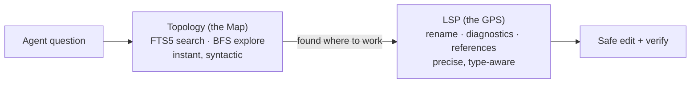

# Topology — plumb's semantic code index

## What is it? (start here)

When you open a large codebase for the first time, the hard part isn't reading
any single file — it's knowing *where things are* and *how they connect*.
**Topology is plumb's answer to that.** It is a small, local database that plumb
builds from your code and keeps up to date in the background. It records the
*structure* of your project — every function, type, method, route, and test, and
the relationships between them (which function calls which, which file imports
which) — so questions like:

- "Where is the routing / auth / database logic?"
- "What calls this function, and what would break if I change it?"
- "Which tests cover this area?"

can be answered **instantly**, without reading the whole repository and without
waiting for any heavy tooling to start.

The name comes from *topology* in the mathematical sense — the shape of how
things are connected. Plumb's topology is a **graph** of your code's entities
(the nodes) and their relationships (the edges), stored in a single file you can
delete and rebuild at any time.

> **You don't need to understand any of the internals to use it.** It is **on by
> default** — the `topology_*` tools (plus faster symbol search) work out of the
> box; opt out with `[topology] enabled = false`. The rest of this page explains
> the benefits and how it works, for the curious.

## Why it exists — the problem it solves

On an unfamiliar codebase, agents and developers hit the same bottleneck:
**discovery is expensive.** The usual options each fall short:

- **Read files** — accurate but slow and token-hungry; you read a lot to find a
  little.
- **Grep / text search** — fast but blind: no ranking, no idea whether a match
  is a definition, a comment, or a call, and no sense of structure.
- **Ask the language server (LSP)** — compiler-grade precision, but it must boot
  and index first (seconds to minutes on a cold or large project), needs the
  right server installed, and wants the code in a compilable state.

Topology fills the gap: **broad, structural answers, available immediately** —
even before (or entirely without) a language server, and even when the code
doesn't compile. For an AI agent that is a large token saving: it can pinpoint
the right few files instead of reading dozens.

## Benefits at a glance

- **Instant.** Answers come from a local SQLite/FTS5 database — no
  language-server boot, no per-conversation indexing wait.
- **Works without a language server.** Useful for JavaScript/TypeScript (which
  has no LSP adapter in plumb) and for any project where the LSP isn't installed.
- **Tolerant of broken code.** It's syntactic, so it keeps working mid-refactor
  when the code won't compile.
- **Structural, not just textual.** Ranked symbol search, neighbourhood
  exploration, and blast-radius/impact analysis — things grep cannot do.
- **Cheap and self-throttling.** A small file under `.plumb/`, maintained by a
  background indexer that paces itself so it never hogs a CPU core.
- **Safe to delete.** It's derived data: drop `topology.db` and plumb rebuilds
  it. (plumb also keeps it out of git automatically.)

The trade-off — a deliberate one — is that topology is *approximate*: it
understands syntax, not full type semantics. That's why plumb pairs it with the
language server.

## The dual-engine model: Map + GPS

Plumb pairs two engines that handle different phases of an agent's work:

- **Topology is the Map.** Use it for discovery: "where is the routing logic?",
  "what's around this symbol?", "what does changing this touch?". It answers
  immediately, tolerates broken code, and has a tiny memory footprint — but it
  is syntactic (Go AST, tree-sitter Python/JavaScript/TypeScript/Rust/Zig/Kotlin/Swift/Java/Bash/HCL/SQL/Dockerfile/TOML/YAML/Markdown, and a TSX/JSX regex extractor), so it offers
  *broad recall*, not compiler-level precision or type resolution.
- **LSP is the GPS.** Once you know *where* to work, the language-server tools
  (`get_definition`, `find_references`, `rename_symbol`, `diagnostics`) make and
  verify changes with full type awareness.

See [Architecture → dual-engine](architecture.md#plumb-topology-vs-lsp-the-dual-engine-architecture)
for how the two fit into plumb's layered design.

## How it works (architecture)

You can skip this section and still use topology happily. For the curious, the
pipeline has four parts:

1. **Extractors read your source.** Per language, a lightweight extractor turns
   a file into a list of *entities* (functions, types, methods, imports, tests)
   and *edges* (calls, imports, containment). Go uses the standard library's
   `go/parser` + `go/ast` (precise, no cgo); Python, Rust, Zig, Kotlin, Swift and
   Java use the pure-Go gotreesitter runtime; JavaScript (`.js`/`.mjs`/`.cjs`)
   and TypeScript (`.ts`) also use gotreesitter; and only TSX/JSX (`.tsx`/`.jsx`)
   still use a fast regex scanner (gotreesitter's TSX grammar cascades on typed
   arrow params — see `docs/internal/treesitter-plan.md`).
   None of this requires the code to compile.
2. **A SQLite + FTS5 database stores the graph.** Entities and edges live in
   tables in `<workspace>/.plumb/topology.db`; an FTS5 (full-text search) virtual
   table powers ranked, typo-tolerant symbol search and splits
   `CamelCase`/`snake_case` so `UserSession` matches both `user` and `session`.
3. **A background indexer keeps it fresh.** One goroutine per workspace: every
   plumb write re-indexes just that file, and a periodic full resync (hourly by
   default) reconciles anything changed outside plumb — a `git pull`, a branch
   switch, another editor. The full resync is **throttled** (it pauses briefly
   every `resync_batch` files) so a large repo's index build never saturates a
   core or competes with your live tool calls; the pause is interruptible so
   daemon shutdown stays fast.
4. **Six tools query the graph** (below), reporting their source and freshness so
   an agent never mistakes an approximate answer for compiler-grade truth.

In plumb's layered architecture, topology is the **Intelligence** layer
(`internal/topology`), sitting below the application/presentation layers and
beside the domain layer — it never depends on higher layers, and other layers
treat it as an optional, rebuildable index.

## When to use topology vs LSP

| You want to… | Use |
|---|---|
| Find where a concept/feature lives | `topology_search` |
| Understand a symbol's neighbourhood | `topology_explore` |
| Assess the blast radius of a change | `topology_impact` |
| Know which tests a change might affect | `topology_affected` |
| List framework entry points (routes, commands) | `topology_routes` |
| Jump to a definition with certainty | `get_definition` (LSP) |
| Find every real call site | `find_references` (LSP) |
| Rename safely across the workspace | `rename_symbol` (LSP) |
| See compile errors | `diagnostics` (LSP) |

A common flow: `topology_search` to locate → `topology_explore`/`topology_impact`
to scope → LSP tools to read and edit precisely → `diagnostics` to verify.

When topology is enabled, the name-lookup tools `find_symbol`,
`workspace_symbols`, and `list_symbols` also **fall back** to the topology index
if the language server errors or times out, returning approximate results
annotated `source=topology, mode=indexed-approximate` rather than failing.

## The six tools

See [Tools → Topology](tools.md#topology) for full inputs. In brief:

- **`topology_status`** — index health: file/entity counts, DB size, indexed
  languages, last sync, last error. (`plumb doctor` also reports this.)
- **`topology_search`** — FTS5 ranked symbol/file search (`query`, optional
  `kinds`/`language` filters).
- **`topology_explore`** — BFS neighbourhood around a named symbol, with depth,
  node, and byte budgets.
- **`topology_impact`** — bidirectional blast radius: what a symbol depends on,
  and what depends on it.
- **`topology_affected`** — *the headline.* Given changed files/symbols, the
  files and tests most likely affected, by inward dependency edges **and**
  co-location (tests in the same directory as a changed/affected file — catching
  sibling test files the call graph alone misses). Recall-biased; each test
  carries a confidence (1.0 containment, 0.8 dependency edge, 0.5 co-located)
  and the reason it was flagged. Use after writing to decide what to run.
- **`topology_routes`** — heuristic, framework-aware entry-point scan (Go HTTP
  handlers, Cobra commands, Python `@app.route`). Results carry a confidence
  annotation.

## Configuration

All `[topology]` fields (see the
[Configuration reference](configuration.md#topology--semantic-index)):

| Field | Default | Effect |
|---|---|---|
| `enabled` | `true` | Turn the index on or off (on by default). |
| `resync_on_attach` | `false` | Full resync each time the workspace attaches. |
| `exclude_patterns` | `[]` | Path globs to skip during indexing. |
| `max_file_size_bytes` | `524288` | Largest file considered (512 KiB). GLR-heavy markup grammars (Markdown, HTML, YAML) carry a tighter built-in 256 KiB inner cap — a file above it is indexed with zero symbols rather than parsed, since a full parse of a large markup file is expensive and low-value. |
| `resync_batch` | `100` | Files extracted before the full resync pauses (CPU throttle). `0` disables pacing. |
| `resync_pause_ms` | `25` | Pause after each `resync_batch` files, in milliseconds. `0` disables pacing. |
| `resync_interval_minutes` | `60` | Periodic full-resync **fallback** (used only when `watch = false` or the watcher can't start); suppressed while the watcher is live; `0` disables. |
| `watch` | `true` | OS-level file watching: re-index a file the moment it changes on disk, regardless of who changed it (agent, another agent, your editor). Replaces polling; falls back to `resync_interval_minutes` when disabled or unavailable. |

The index is enabled per project or globally. It writes only to
`<workspace>/.plumb/topology.db` (and its SQLite `-wal`/`-shm` sidecars), which
plumb adds to `.plumb/.gitignore` automatically so the rebuildable index is
never committed.

## Trade-offs and limitations

- **Syntactic, not semantic.** Topology does not resolve types or follow dynamic
  dispatch. Treat its graph as a strong hint, then confirm with LSP.
- **`topology_routes` is heuristic.** It pattern-matches known frameworks; always
  read the confidence annotation.
- **Freshness is eventual.** Edits made through plumb re-index immediately;
  external changes are picked up by the periodic resync (or on the next attach).
- **Enabled by default.** Opt out with `[topology] enabled = false` (per-project
  or global) — e.g. for a very large repo you do not want indexed. On first
  attach the index is created at `<workspace>/.plumb/topology.db` (auto-gitignored);
  this is the one case where plumb materialises `.plumb/` for a project.
