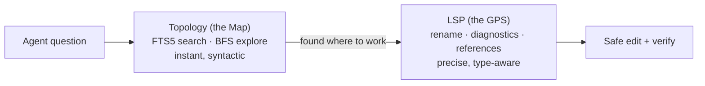

# Topology — plumb's semantic code index

## What is it? (start here)

When you open a large codebase for the first time, the hard part isn't reading
any single file — it's knowing *where things are* and *how they connect*.
**Topology is plumb's answer to that.** It is a small, local database that plumb
builds from your code and keeps up to date in the background. It records the
*structure* of your project — every function, type, method, route, and test, and
the relationships between them (which function calls which, which file imports
which) — so questions like:

- "Where is the routing / auth / database logic?"
- "What calls this function, and what would break if I change it?"
- "Which tests cover this area?"

can be answered **instantly**, without reading the whole repository and without
waiting for any heavy tooling to start.

The name comes from *topology* in the mathematical sense — the shape of how
things are connected. Plumb's topology is a **graph** of your code's entities
(the nodes) and their relationships (the edges), stored in a single file you can
delete and rebuild at any time.

> **You don't need to understand any of the internals to use it.** It is **on by
> default** — the `topology_*` tools (plus faster symbol search) work out of the
> box; opt out with `[topology] enabled = false`. The rest of this page explains
> the benefits and how it works, for the curious.

## Why it exists — the problem it solves

On an unfamiliar codebase, agents and developers hit the same bottleneck:
**discovery is expensive.** The usual options each fall short:

- **Read files** — accurate but slow and token-hungry; you read a lot to find a
  little.
- **Grep / text search** — fast but blind: no ranking, no idea whether a match
  is a definition, a comment, or a call, and no sense of structure.
- **Ask the language server (LSP)** — compiler-grade precision, but it must boot
  and index first (seconds to minutes on a cold or large project), needs the
  right server installed, and wants the code in a compilable state.

Topology fills the gap: **broad, structural answers, available immediately** —
even before (or entirely without) a language server, and even when the code
doesn't compile. For an AI agent that is a big token-efficiency win: it can pinpoint
the right few files instead of reading dozens.

## Benefits at a glance

- **Instant.** Answers come from a local SQLite/FTS5 database — no
  language-server boot, no per-conversation indexing wait.
- **Works without a language server.** Useful for any project where the relevant
  language server isn't installed, and for config/markup formats that have no LSP
  at all.
- **Tolerant of broken code.** It's syntactic, so it keeps working mid-refactor
  when the code won't compile.
- **Structural, not just textual.** Ranked symbol search, neighbourhood
  exploration, and blast-radius/impact analysis — things grep cannot do.
- **Cheap and self-throttling.** A small file under `.plumb/`, maintained by a
  background indexer that paces itself so it never hogs a CPU core.
- **Safe to delete.** It's derived data: drop `topology.db` and plumb rebuilds
  it. (plumb also keeps it out of git automatically.)

The trade-off — a deliberate one — is that topology is *approximate*: it
understands syntax, not full type semantics. That's why plumb pairs it with the
language server.

## The dual-engine model: Map + GPS

Plumb pairs two engines that handle different phases of an agent's work:

```mermaid
flowchart LR
    Q["Agent question"] --> TOPO["Topology (the Map)<br/>FTS5 search · BFS explore<br/>instant, syntactic"]
    TOPO -->|found where to work| LSP["LSP (the GPS)<br/>rename · diagnostics · references<br/>precise, type-aware"]
    LSP --> EDIT["Safe edit + verify"]
```

- **Topology is the Map.** Use it for discovery: "where is the routing logic?",
  "what's around this symbol?", "what does changing this touch?". It answers
  immediately, tolerates broken code, and has a tiny memory footprint — but it
  is syntactic (Go AST; pure-Go tree-sitter for TypeScript/TSX/JSX, Python,
  Ruby, C, PHP, JSON, CSS, SCSS, XML, Lua, C++, Objective-C, Dart, JavaScript, Rust, Zig, Kotlin, Java, Bash, HCL, SQL, Dockerfile, TOML,
  YAML and Markdown; and canonical-grammar WASM for Swift), so it offers
  *broad recall*, not compiler-level precision or type resolution.
- **LSP is the GPS.** Once you know *where* to work, the language-server tools
  (`get_definition`, `find_references`, `rename_symbol`, `diagnostics`) make and
  verify changes with full type awareness.

See [Architecture → dual-engine](architecture.md#plumb-topology-vs-lsp-the-dual-engine-architecture)
for how the two fit into plumb's layered design.

### Languages the Map does not cover

**There are currently none.** Every language plumb recognises now has an
extractor, so `topology_status` has no coverage gap to report. This section
stays because the machinery does, and because the next language added will need
it.

For a language plumb recognises but has no extractor for, the files are still
recorded and contribute no symbols. That gap is reported rather than left to be
inferred, because an empty Map result is otherwise indistinguishable from a
codebase that genuinely has nothing in it:

- `topology_status` lists it as `not covered: xml (330), json (312)`, busiest
  first, and no longer counts those files under `indexed files`.
- `file_outline` on such a file says so instead of printing a bare `(no symbols)`.
- `session_start` warns when the workspace's *primary* language is one of them.

`search_in_files` and `read_file` work on every language regardless, and an
attached language server still answers hover and definition queries.

Wiring a language is a flip from `EngineNone` to `EngineTreeSitter` in
`internal/langsupport` plus an extractor constructor — the registry doubles as
the coverage roadmap. Because an uncovered file is stored with an empty content
hash, adding an extractor makes every such file stale automatically and the next
resync picks it up; no reindex flag or schema change is needed.

## How it works (architecture)

You can skip this section and still use topology happily. For the curious, the
pipeline has four parts:

1. **Extractors read your source.** Per language, a lightweight extractor turns
   a file into a list of *entities* (functions, types, methods, imports, tests)
   and *edges* (calls, imports, containment). Go uses the standard library's
   `go/parser` + `go/ast` (precise, no cgo); Python, Ruby, C, PHP, JSON, CSS, SCSS, XML, Lua, C++, Objective-C, Dart, Rust, Zig, Kotlin, Java,
   JavaScript (`.js`/`.mjs`/`.cjs`), TypeScript (`.ts`) and TSX/JSX
   (`.tsx`/`.jsx`) use the pure-Go gotreesitter runtime; Swift uses the
   canonical tree-sitter grammar compiled to WASM and run via wazero, until
   the remaining upstream gotreesitter Swift parse gaps close.
   None of this requires the code to compile.
2. **A SQLite + FTS5 database stores the graph.** Entities and edges live in
   tables in `<workspace>/.plumb/topology.db`; an FTS5 (full-text search) virtual
   table powers ranked, typo-tolerant symbol search and splits
   `CamelCase`/`snake_case` so `UserSession` matches both `user` and `session`.
3. **A background indexer keeps it fresh.** One goroutine per workspace: every
   plumb write re-indexes just that file, and a periodic full resync (hourly by
   default) reconciles anything changed outside plumb — a `git pull`, a branch
   switch, another editor. The full resync is **throttled** (it pauses briefly
   every `resync_batch` files) so a large repo's index build never saturates a
   core or competes with your live tool calls; the pause is interruptible so
   daemon shutdown stays fast.
4. **Six tools query the graph** (below), reporting their source and freshness so
   an agent never mistakes an approximate answer for compiler-grade truth.

In plumb's layered architecture, topology is the **Intelligence** layer
(`internal/topology`), sitting below the application/presentation layers and
beside the domain layer — it never depends on higher layers, and other layers
treat it as an optional, rebuildable index.

## When to use topology vs LSP

| You want to… | Use |
|---|---|
| Find where a concept/feature lives | `topology_search` |
| Understand a symbol's neighbourhood | `topology_explore` |
| Assess the blast radius of a change | `topology_impact` |
| Know which tests a change might affect | `topology_affected` |
| Find symbols shaped like entry points (handler/command name patterns) | `topology_routes` |
| Jump to a definition with certainty | `get_definition` (LSP) |
| Find every real call site | `find_references` (LSP) |
| Rename safely across the workspace | `rename_symbol` (LSP) |
| See compile errors | `diagnostics` (LSP) |

A common flow: `topology_search` to locate → `topology_explore`/`topology_impact`
to scope → LSP tools to read and edit precisely → `diagnostics` to verify.

When topology is enabled, the name-lookup tools `workspace_symbols`
and `file_outline` also **fall back** to the topology index
if the language server errors or times out, returning approximate results
annotated `source=topology, mode=indexed-approximate` rather than failing.

## The six tools

See [Tools → Topology](tools.md#topology) for full inputs. In brief:

- **`topology_status`** — index health: file/entity counts, DB size, indexed
  languages, last sync, last error. (`plumb doctor` also reports this.)
- **`topology_search`** — FTS5 ranked symbol/file search (`query`, optional
  `kinds`/`language` filters).
- **`topology_explore`** — BFS neighbourhood around a named symbol, with depth,
  node, and byte budgets.
- **`topology_impact`** — bidirectional blast radius: what a symbol depends on,
  and what depends on it. `mode: "reachability"` switches to a different, package-level
  question — see [Package-level reachability](#package-level-reachability) below.
- **`topology_affected`** — *the headline.* Given changed files/symbols, the
  files and tests most likely affected, by inward dependency edges **and**
  co-location (tests in the same directory as a changed/affected file — catching
  sibling test files the call graph alone misses). Recall-biased; each test
  carries a confidence (1.0 containment, 0.8 dependency edge, 0.5 co-located)
  and the reason it was flagged. Use after writing to decide what to run.
- **`topology_routes`** — pattern-matches entry-point-shaped symbol names/signatures
  (Go HTTP handlers, Cobra commands, Python `@app.route`). It does **not** parse route
  registrations or call sites, so it cannot recover a path-to-handler binding (e.g.
  `"/api/x" -> handlerFn`) — only symbol-name/signature candidates, each carrying a
  confidence annotation.

## Package-level reachability

`topology_impact mode="reachability"` answers a different question than the rest of
the tools above, at a different granularity: not "what does this *symbol* touch" but
**"what does this *binary* (or entry point) actually pull in"** — and its mirror,
"which packages are unreachable from every entry point". This is honest, available
today, package-level reachability, built entirely on the `imports` edges `linkImports`
already produces — no schema change, no new tool (`topology_impact` gained a `mode`
rather than adding to the tool count).

**Granularity, stated plainly.** Every reachability response opens with `package-level
(import edges, production imports only — Go _test.go importers excluded);
function-level unavailable` — this is directory granularity, not function-level. The
import graph is real and cross-file; there is no cross-package call graph yet, so this
cannot answer "is this *function* dead" — only "is this *package* dead from every entry
point". Treat a small unreachable package as a strong signal and a genuinely large one
as worth a second look before deleting; a symbol re-exported by an otherwise-unreachable
package could still be imported reflectively.

**Production imports only.** An edge whose importer is a Go `_test.go` file is excluded
from the graph, on purpose. Go forbids real import cycles, so any cycle a naive version
of this feature could report was necessarily a `_test.go`-only artefact — measured on
plumb's own index, 64% of the folded edges originated in a test file, and every cycle an
early build of `layers` reported vanished once those edges were excluded. The
consequence for the default shape: a package pulled in only by a sibling package's test
file (a test helper, a fixture) is reported **unreachable**, which is the intended
answer to "what does the binary pull in" — it never ships. **This cuts both ways, and
the destructive direction is undisclosed nowhere else but here without this sentence:**
on plumb's own index, `internal/lsp/conformance` and `internal/lsp/lsptest` — real,
in-use test-support packages — show up in the unreachable list precisely because
nothing but a `_test.go` file imports them. The response's `unreachable` line says so
directly: *"a package used only by tests appears here by design — confirm before
deleting."* Treat every unreachable result as a lead to verify, not a deletion list.

**Build-tag-excluded files are still indexed, and still counted.** The extractor is
syntactic (`go/parser`), not build-aware: a file gated to another OS/arch (e.g.
`foo_linux.go` on a macOS index) is parsed and its imports folded into the graph
regardless of whether the current build would ever compile it. A package reachable only
through such a file may be reported reachable on a platform where it is not actually
built — check `go list` or the build tags directly before trusting a borderline result.

**Go-only, for now.** Folding edges into this graph needs a package node to carry its
own outward `imports` edge to an import node in the same file — today only the Go
extractor (`extractors/golang`) emits that shape. On a workspace whose primary language
doesn't (C#, PHP, Scala, Elixir, …), `mode="reachability"` detects the case and refuses
with a clear message rather than reporting every package "unreachable", which is what an
unguarded version of this feature did. The detection is deliberately not "zero foldable
edges" alone — a genuinely small Go workspace can have zero too (every cross-package
import is stdlib-only, or its only cross-package import lives in a `_test.go` file,
which is excluded per the production-imports-only rule above); the refusal fires only
when the index ALSO carries no independent evidence of Go — specifically, no `package`
node with `language=go`. That check is deliberately narrower than "no `import` node at
all": C#, PHP, Elixir, and Scala — the four non-Go languages whose extractors can
populate a directory at all — each emit their own `import`-shaped nodes too, so a
broader "any import node" signal would have made the refusal unreachable for every
workspace it exists to catch. A Go `package` clause is mandatory and per-file, so a
`language=go` package node is unambiguous evidence no other extractor produces.

**Roots.** Every `package main` directory by default, plus `topology_routes`
entry-point candidates (an HTTP handler, a Cobra command — labelled
`candidate-seeded` in the response, since `topology_routes` results are themselves
name/signature heuristics, not confirmed bindings). Pass `roots` explicitly to override:
an array of directories, or the literal `"main"`.

**Three response shapes**, each capped at ~5 KB:

- **default** — reachable/unreachable package counts, with up to 10 samples per
  bucket. Unreachable is sorted by size (indexed node count) descending — the biggest
  dead package is the most actionable one to notice.
- **`path_to: "<dir>"`** — the single shortest root → target directory chain, or an
  honest "no path" when the target is not reachable from the given roots.
- **`layers: true`** — a Tarjan strongly-connected-components condensation of the
  reachable subgraph, laid out as topological layers. A component holding more than one
  package **is** a reported import cycle (flagged `[cycle]`), not filtered out — that is
  the finding this shape exists to surface.

**Correctness note for the curious.** Computing "unreachable" correctly requires the
*full* transitive closure from the roots, not a bounded neighbourhood — a depth-capped
walk would silently misreport a genuinely reachable package as unreachable on any
dependency chain longer than the cap, which is the false-negative direction this
feature is built to avoid. The traversal therefore runs to full closure over a
directory-level graph folded from the same `imports` edges, rather than reusing the
depth/byte-capped symbol-neighbourhood BFS used elsewhere in this page.

## Cross-file call edges (Go only, and small)

The index records **call sites** — every call expression, resolved or not — in
`topology_call_sites`, and a resolver turns the package-qualified ones into cross-file
`calls` edges tagged `source = "call-resolver"`. Before this, every call edge in the
index was intra-file: extractors run per file and emit edges as indices into that file's
own node slice, so nothing they produced could name a symbol in another file, and a
callee the extractor could not match was dropped without a trace.

**Read the reach number before you read the graph.** Measured on plumb's own tree
(1,414 indexed files, 1,283 of them Go):

| | |
|---|---:|
| recorded Go call sites | 89,942 |
| …carrying a qualifier (`x.F()`) | 60,803 |
| cross-file `call-resolver` edges | **2,531** |
| …with a non-`_test.go` caller | **882** |
| distinct targets reached | 378 |
| **share of all call sites resolved** | **2.8%** |

Every qualified site lands in exactly one bucket, and the six add up to the 60,803 above —
that is what makes this a measurement rather than an impression:

| qualified-site bucket | |
|---|---:|
| resolved into an edge | 2,531 |
| method call on a receiver, left unresolved | 37,635 |
| qualified call leaving the indexed tree (stdlib, third party) | 20,376 |
| repeat of a caller→target edge already emitted | 258 |
| names no exported top-level function in the target package | 3 |
| no enclosing declaration to hang the edge on | 0 |

The last two buckets are small here and are not decoration: the repeat bucket is where 258
sites used to vanish from the count, and the no-caller bucket is a fact about the *caller*
that used to be reported under the target's wording.

`topology_status` prints these for your own workspace. **2.8% is the headline, not a
caveat.** A package-qualified-functions-only resolver reaches the calls that cross a
package boundary and nothing else; the single most common Go call is a method call on a
receiver variable, and the Go extractor parses with `SkipObjectResolution`, so there is
no type information anywhere in the index that could turn a receiver *variable* into the
type whose method was called. Those edges are **absent and counted**, never guessed:
20.8% of plumb's own callables share a name with another callable, so textual receiver
matching would manufacture wrong edges at scale.

**What resolves.** A call `pkg.Fn()` whose `pkg` is an import of *that same file*, whose
import path names a directory the index holds, and whose `Fn` is an exported top-level
function declared there. Per-file import sets are the whole precision story — a global
by-name resolver is what the name-collision figure above rules out. An unexported callee
behind a qualifier is treated as a receiver call, because a local variable can shadow an
import name and that is the only reading which cannot invent an edge.

One shape is invisible to this: Go does not require a package's name to match its
directory, and for an *unaliased* import the index derives the local name from the import
path's last element. A call qualified by a package whose name differs from its directory
(`internal/utils` declaring `package util`) therefore misses the file's import set and is
counted as a method call on a receiver, which it is not. It is a missing-edge and
mis-label case, never a false edge, and plumb's own tree has zero of them. Explicit import
aliases resolve correctly.

**Test callers are included, and the split is published.** A test calling the function it
exercises is the most useful cross-file call edge there is, so `_test.go` callers are
resolved and counted; the non-test subset is reported alongside so a consumer that must
exclude them (import-cycle reasoning, for one) can filter on the caller's path. This is
the opposite of `mode="reachability"`'s production-imports-only rule, deliberately: that
rule exists because Go forbids import cycles, and a call edge implies no such constraint.
Vendored and generated code follow the index's existing rule and get no special case —
`vendor/`, `node_modules/`, `testdata/`, `dist/` and `build/` are excluded from the walk,
and everything else that is indexed contributes call sites.

**Nothing consumes these edges yet, and that is enforced rather than intended.** They are
derived data, rebuilt wholesale on every indexing pass exactly like the `import-resolver`
edges, and their behaviour under an incremental single-file re-index is not yet pinned —
a consumer can observe the window in which a re-indexed file's edges are gone. So the
neighbourhood traversal excludes them by **source**: `ExploreOpts.IncludeDerivedCalls`
defaults to false, and every tool that asks for `calls` edges (`call_hierarchy`'s topology
fallback, `topology_impact`, `topology_affected`, `minimal_diff_review`) receives the
extractor's intra-file edges and nothing else. Excluding by edge *kind* would not work:
the derived edges are `calls` edges, identical in kind to the extractor's own.

**Language admission.** A language is served iff it is in the resolver's compile-time
supported set (today exactly `{go}`) **and** the index holds a `package` node with that
language. Both terms are positive: no edge count, no coverage ratio, no "primary
language" heuristic. The *subject* of a query — the symbol or file asked about — selects
which language's admission is consulted, so a repository that is 90% TypeScript with one
`tools/gen.go` gives the Go subject a normal Go answer and the TypeScript subject an
honest refusal, and neither answer silently includes the other language's files. A
traversal admitted for one language never crosses into another's nodes; those are
reported *out of scope*, which is a different fact from having no callers.

For a language that is refused, the alternatives offered depend on whether plumb ships a
language server adapter for it: with one, `find_references` and `call_hierarchy` answer
the cross-file question properly through the server; without one, `search_in_files` over
the symbol name is the honest tool and the refusal says so rather than implying a server
exists. Package-level reachability is **not** offered as the coarser answer, because it
is gated to the same language set.

## Configuration

All `[topology]` fields (see the
[Configuration reference](configuration.md#topology--semantic-index)):

| Field | Default | Effect |
|---|---|---|
| `enabled` | `true` | Turn the index on or off (on by default). |
| `resync_on_attach` | `false` | Full resync each time the workspace attaches. |
| `exclude_patterns` | `[]` | Path globs to skip during indexing. |
| `max_file_size_bytes` | `524288` | Largest file considered (512 KiB). |
| `extract_timeout_seconds` | `10` | Longest one file's parse may run before it is abandoned and recorded as a file error. The size caps above bound how much source a grammar sees, not how long it spends: error recovery can go superlinear on a small file, and the indexer runs a single worker, so an unbounded parse would stall every file behind it. Bounded by a built-in 2-minute ceiling: this setting can LOWER the bound but not remove it, since an unbounded parse can wedge the single indexer worker permanently, so `0` means "use the ceiling" rather than "unbounded". A file that times out is recorded with its mtime (not a content hash), so every full resync re-attempts it and re-pays the full timeout — a pathological file costs one timeout per resync cycle. |
| `resync_batch` | `100` | Files extracted before the full resync pauses (CPU throttle). `0` disables pacing. |
| `resync_pause_ms` | `25` | Pause after each `resync_batch` files, in milliseconds. `0` disables pacing. |
| `resync_interval_minutes` | `60` | Periodic full-resync **fallback** (used only when `watch = false` or the watcher can't start); suppressed while the watcher is live; `0` disables. |
| `watch` | `true` | OS-level file watching: re-index a file the moment it changes on disk, regardless of who changed it (agent, another agent, your editor). Replaces polling; falls back to `resync_interval_minutes` when disabled or unavailable. |

The index is enabled per project or globally. It writes only to
`<workspace>/.plumb/topology.db` (and its SQLite `-wal`/`-shm` sidecars), which
plumb adds to `.plumb/.gitignore` automatically so the rebuildable index is
never committed.

## Trade-offs and limitations

- **Syntactic, not semantic.** Topology does not resolve types or follow dynamic
  dispatch. Treat its graph as a strong hint, then confirm with LSP.
- **Cross-file call edges cover ~3% of call sites, in Go only.** See the section above:
  method calls on a receiver are the modal Go call and are left unresolved by design, so
  a caller list from the topology call graph is a lower bound and never a complete one.
  Confirm with `find_references`.
- **`topology_routes` is heuristic and name/signature-only.** It pattern-matches
  known entry-point idioms against symbol names and signatures; it does **not** parse
  route registrations or call sites, so it cannot map a path to its handler. Always
  read the confidence annotation.
- **Freshness is eventual.** Edits made through plumb re-index immediately;
  external changes are picked up by the periodic resync (or on the next attach).
- **Enabled by default.** Opt out with `[topology] enabled = false` (per-project
  or global) — e.g. for a very large repo you do not want indexed. On first
  attach the index is created at `<workspace>/.plumb/topology.db` (auto-gitignored);
  this is the one case where plumb materialises `.plumb/` for a project.
